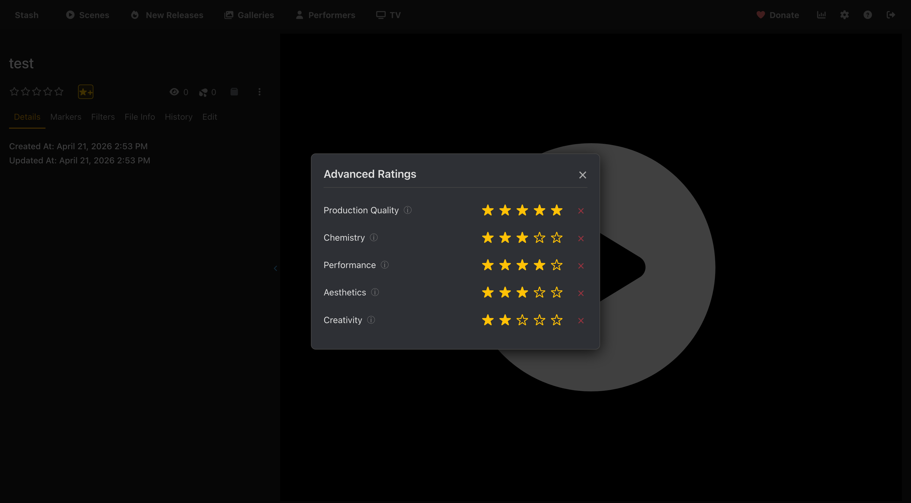
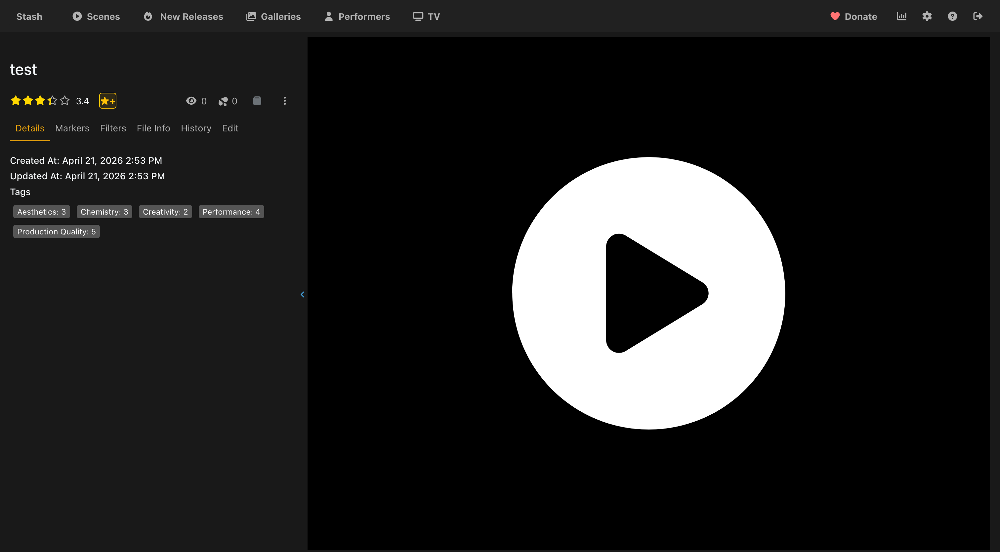

# Advanced Scene Rating

A Stash plugin that adds a multi-category rating system for scenes. Rate each scene across several criteria (Production Quality, Chemistry, etc.), optionally bucket them into weighted groups, and Stash's overall scene rating is calculated and updated automatically.

Everything is configured through a dedicated settings panel — no plugin tasks, no manual tag creation. Rename criteria, add custom ones, tweak weights, and add/remove groups all in one place.

## Credits

Inspired by the [Advanced Rating System](https://discourse.stashapp.cc/t/advanced-rating-system/3096) plugin on the Stash community forums, which introduced the concept of using tags for multi-category ratings.

## Requirements

- [Stash](https://stashapp.cc) v0.27+
- Python 3.x
- [stashapp-tools](https://github.com/stg-annon/stashapp-tools) (bundled in `vendor/`; auto-installed via pip when available)

## Installation

### Option 1 — Automatic (recommended)

1. In Stash go to **Settings → Plugins → Add Source** and enter:
   ```
   https://ordureconnoisseur.github.io/plugins/main/index.yml
   ```
2. Find **Advanced Scene Rating** in the plugin browser and click **Install**.
3. Open **Settings → Plugins → Advanced Scene Rating** and click **Save** in the panel — this persists the default config and creates the rating tags for you.

### Option 2 — Manual

1. Download this repository (Code → Download ZIP) and extract it.
2. Place the extracted folder inside a category subfolder of your Stash plugins directory:
   - **Linux/Mac:** `~/.stash/plugins/Utilities/Advanced Scene Rating/`
   - **Windows:** `%USERPROFILE%\.stash\plugins\Utilities\Advanced Scene Rating\`

   > The plugin must be **two levels deep** inside the plugins directory — `plugins/Category/Plugin/`. Placing it directly under `plugins/` will cause it not to appear in Stash.

3. In Stash, go to **Settings → Plugins** and click **Reload Plugins**.
4. Enable **Advanced Scene Rating**.
5. Open the plugin's settings panel and click **Save** to seed config + create tags.

## Usage

Click the **★+** button on any scene's page to open the rating modal. The button shows a count badge when the scene has criteria still unrated — yellow if the scene is partially rated (e.g. you've added a new criterion since the scene was last rated), grey when fully unrated. No badge means every criterion is rated.



When you have multiple configured groups, the modal renders each criterion grouped by its group with a bold header (default single-group setups suppress the header for a clean look). Rate each category using the 1–5 star selectors. Hover over the ⓘ icon next to a category name to see its description. Unrated criteria are highlighted with a small pill so you can see at a glance which ones still need a score. As you click stars, the corresponding category tag (`Production Quality ★: 4`, etc.) is applied to the scene and the overall Stash rating recalculates automatically via the `Scene.Update.Post` hook.

Click **Score breakdown** at the bottom of the modal to expand a panel that shows exactly how the rating is being calculated: per-group weighted average, then the final weighted mean across groups, and the rating100 result after precision snapping. The collapsed/expanded state is remembered across sessions.



## Configuration

Open **Settings → Plugins → Advanced Scene Rating** to access the settings panel. The panel replaces Stash's native settings UI (which can't render dropdowns or reliably persist non-boolean values) with a fully interactive React component.

### General

- **Rating Star Precision** — auto-matched from Stash's own rating-system setting (Settings → Interface → Editing → Rating System). `FULL = 20`, `HALF = 10`, `QUARTER = 5`, `TENTH = 1`, `DECIMAL = 1`. The panel polls Stash every few seconds so the displayed value tracks any change you make without reopening the panel.
- **Allow Destructive Actions** — gates the orange "Remove orphaned tags" and red "Delete all rating tags" buttons. Off by default.

### Groups

Criteria are bucketed into groups, and the final rating is a weighted mean of each group's average.

- **Name** — display label. Renaming a group doesn't touch any tags (tags are per-criterion, not per-group).
- **Weight** — how much this group counts in the final score relative to others.
- **Reorder / Delete** — at least one group must exist. Deleting a group reassigns its criteria to another group.

The default config has a single **Overall** group, which reduces the math to a flat weighted average across all enabled criteria (the original plugin's behavior). Add more groups if you want to balance buckets — e.g. "Technical" vs. "Performers" with their own weights.

### Criteria

Each criterion is a rateable category that produces a tag prefix `<Name>` with children `<Name>: 0` … `<Name>: 5`.

| Field | Meaning |
|---|---|
| Toggle | Enabled / disabled. Disabled criteria are ignored by the rating math and hidden from the modal. |
| Name | Display name. Used as the tag prefix (a `★` is automatically appended in the tag name). |
| Group | Which group this criterion contributes to. Populated from the configured group list. |
| Weight | How much this criterion counts within its group. |
| ✎ | Edit the description shown as a tooltip in the rating modal. Clear it to hide the tooltip; **Reset to default** restores the bundled wording (only available for the five default criteria). |
| ↑ ↓ | Reorder. |
| × | Remove the criterion from this configuration. Tags stay on disk — use **Remove orphaned tags** to clean up. |

**+ Add criterion** appends a new custom criterion with a generated slug id.

### Actions

- **Save** — persists configuration AND automatically creates any missing tags for new criteria AND renames tags for any criterion you renamed. One click handles every workflow.
- **Recalculate all scenes** — walks every scene in Stash and updates its `rating100` based on the current configuration. Useful after changing weights or group settings.
- **Reset to defaults** — restores the bundled single group + five criteria.
- **Remove orphaned tags** — scans Stash for criterion tags whose criterion was renamed or removed and deletes them with their `0–5` children. Requires Allow Destructive Actions.
- **Delete all rating tags** — destroys the parent tag plus every configured criterion's tags. Requires Allow Destructive Actions.

## How It Works

Each criterion produces a tag prefix like `Production Quality ★`, with six child tags `Production Quality ★: 0` through `Production Quality ★: 5` organised under a single `Advanced Rating System` parent tag. The `★` suffix is added automatically so the rating tags stand out in tag listings.

### Upgrading from v2.0.x

Pre-v2.3 versions of this plugin used unsuffixed tag names (`Production Quality: 4`). On first **Save** in the v2.3.1+ panel, the plugin automatically renames any existing legacy tags in place — your scene ratings are preserved. Until you click Save, the hook also accepts the legacy names so live recalculation keeps working.

When a scene is updated, the `Scene.Update.Post` hook fires the Python script. It:

1. Reads the plugin's configuration from Stash's plugin-config store.
2. Builds the criteria/groups model.
3. Scans the scene's tags for any matching `<prefix>: <0–5>`.
4. Computes a weighted average per group, then a weighted mean across groups.
5. Snaps the result to Stash's configured rating precision and updates `rating100`.

### Rating Calculation

For each group `g` with at least one matching tag:

```
group_avg(g) = Σ(score × criterion_weight) / Σ(criterion_weight)
```

Final rating:

```
final_avg = Σ(group_avg(g) × group_weight(g)) / Σ(group_weight(g))   over groups with hits
rating100 = round(final_avg × 20, snapped to precision)
```

- One group → flat weighted average across all enabled criteria (the default).
- Multiple groups with weight → weighted mean of their averages.
- Groups with no tag matches are skipped; if no groups have any hits, the rating is not updated.

## License

AGPL v3. See `LICENSE`.
