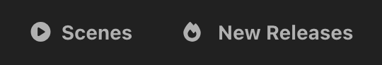
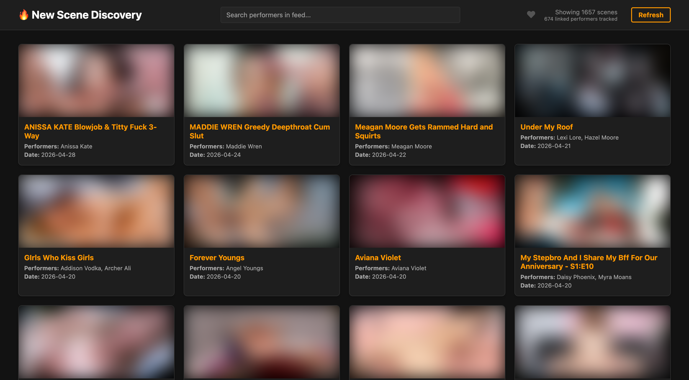
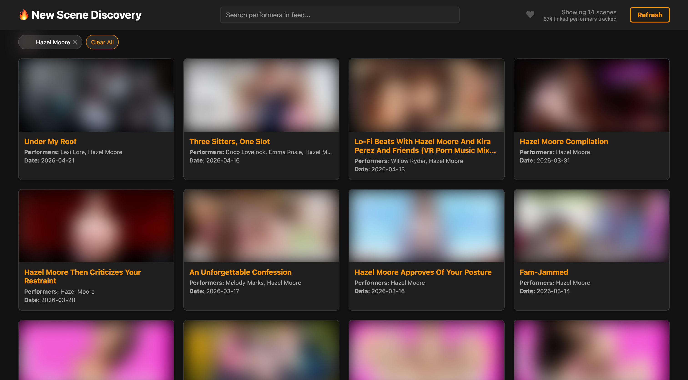

# New Scene Discovery

A Stash plugin that finds recently released scenes from your performers on StashDB. Opens as a dedicated page showing a feed of new scenes you don't own yet, filtered to performers in your library.

## Credits

Inspired by [SceneHub](https://discourse.stashapp.cc/t/scenehub/123) on the Stash community forums, which provided the foundation for the UI layout and the idea of a dedicated scene discovery page. This plugin reimagines it around StashDB — querying new releases directly from StashDB, filtering to only performers in your own library, and adding features like performer search, filter pills, and a favorites-only toggle.

## Requirements

- [Stash](https://stashapp.cc) v0.27+
- A [StashDB](https://stashdb.org) account linked in Stash (**Settings → Metadata Providers → StashBox**)
- Performers in your library must have StashDB IDs linked

## Installation

### Option 1 — Automatic (recommended)

1. In Stash go to **Settings → Plugins → Add Source** and enter:
   ```
   https://ordureconnoisseur.github.io/plugins/main/index.yml
   ```
2. Find **New Scene Discovery** in the plugin browser and click **Install**

### Option 2 — Manual

1. Download this repository (Code → Download ZIP) and extract it
2. Place the extracted folder inside a category subfolder of your Stash plugins directory:
   - **Linux/Mac:** `~/.stash/plugins/UI & Stats/New Scene Discovery/`
   - **Windows:** `%USERPROFILE%\.stash\plugins\UI & Stats\New Scene Discovery\`

   > The plugin must be **two levels deep** inside the plugins directory — `plugins/Category/Plugin/`. Placing it directly under `plugins/` will cause it not to appear in Stash.

3. In Stash, go to **Settings → Plugins** and click **Reload Plugins**
4. Enable **New Scene Discovery**
5. A **🔥 New Releases** button will appear in the Stash navigation bar

## Usage

After enabling the plugin a **🔥 New Releases** button appears in the Stash navigation bar alongside the standard nav items.



Click it to open the discovery page in a new tab. It shows a grid of recently released scenes from your performers that you don't already have in your library.



- **Search** performers in the feed using the search bar
- **Filter pills** let you narrow the feed to a specific performer — click a pill to show only their scenes



- **Favorites toggle** (♥) filters to only scenes featuring performers you have marked as a favourite in Stash
- **Refresh** forces a fresh fetch from StashDB, bypassing the cache
- **Copy ID** (appears on hover) copies the StashDB scene ID to your clipboard for easy importing

Results are cached for 12 hours to avoid hammering the StashDB API on every page load.

## Configuration

Go to **Settings → Plugins → New Scene Discovery** to configure:

| Setting | Default | Description |
|---|---|---|
| New Releases (in Days) | `90` | How far back to look for new scenes |
| Max Scenes Per Performer | `0` | Cap scenes per performer to prevent one from dominating the feed (0 = unlimited) |
| Default to Favorites Only | `false` | If enabled, the favorites filter is on by default when you open the page |

> **Note:** Due to a bug in Stash, settings fields will appear blank even when defaults are set. You don't need to fill them in — the plugin uses the defaults shown above automatically if a field is left empty. Only enter a value if you want to override the default.

## How It Works

1. Fetches all performers from your Stash library that have a StashDB ID linked
2. Queries StashDB in batches for scenes released after the cutoff date featuring those performers
3. Filters out scenes you already own (matched by StashDB ID)
4. Displays the remaining scenes sorted by release date, newest first
